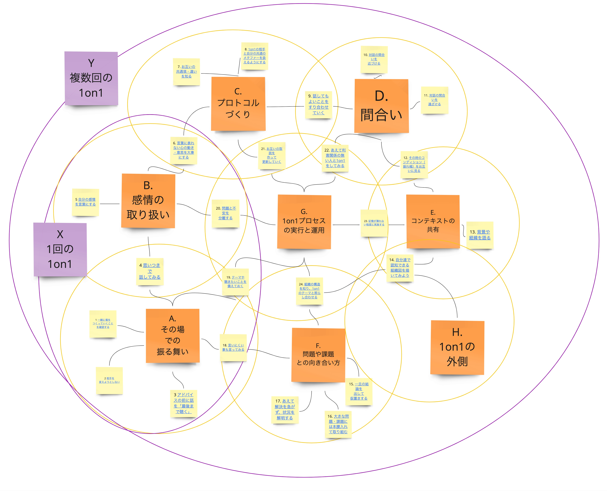

== カテゴリー

=== A.その場での振る舞い

1回の1on1を実施するにあたり、その場をより良くするために、準備したり、心構えしたりする。自分のタイプによって、積極的に動いた方がいいケースも、一旦聞き手に回るケースもあるので、心構え・スタンスに悩んだら一度目を通してみよう。

=== B.感情の取り扱い

1on1が業務の中で行われることから、話すトピックが事実の羅列になってしまうことで、単なる報告になってしまう。そうではなく、人が抱く感情の中に大事なことがあるので、お互いの感情を含めて話すことで、相手の感情への認識が生まれて、お互いに話すことに対する障壁が小さくなり、結果として、組織・個人にとって重要な事柄を話せることになる。

=== C.プロトコルづくり

1on1を円滑に進めるために、あらかじめ約束事（プロトコル）を決め、共通認識をっ持っておいた方がいい。組織単位・チーム単位のプロトコル・共通認識もあってよいが、1on1の当事者であるふたりの中でのプロトコル・共通認識を決めて実施するのがより良いだろう。

=== D.間合い

1on1はそもそも人と人とのコミュニケーションなので、「適切なタイミングと適切な心理的（物理的）な距離感」＝「間合い」で成り立っている。1on1を実施する誰もが、その時の状況に応じて、互いに「間合い」を調整し続けながら実施している。その中で、「間合い」を知識として頭に入れておき、探っていくことで、よりよい1on1になると考える。

=== E.コンテキストの共有

同じ言葉でも、文脈・コンテキストが異なると違う意味になることもある。そのため、お互い共通の文脈（属している組織の話など）や、個人なりの文脈を共有することで、相互の理解が早くなり、互いの意図を間違えにくくできる。

=== F.問題や課題との向き合い方

問題や課題の1つ1つをタスクのように解決を急いだり、すべてを丁寧に取り組んだりすることが正解とは限らない。一旦仮置きしたり、状況を明らかにする方向に話を進めたり、本腰を入れて取り組んだり、様々な向き合い方がある中で、ベストと思われる向き合い方を選ぶ。

=== G.1on1プロセスの実行と運用

1on1で話の中身に集中しないといけない場面も多いが、もうひとつ客観的な視点で1on1プロセスを見て、実施内容を調整しよう。

=== H.1on1の外側

1on1ミーティング（以下1on1）には、1on1以外の事柄も重要なこととして関わってくる。そもそも、組織の構造や、1on1以外の時間の使い方や振る舞いとは不可分であり、1on1だけで解決するものではない。常に1on1以外の事柄も意識しながら進める必要がある。

